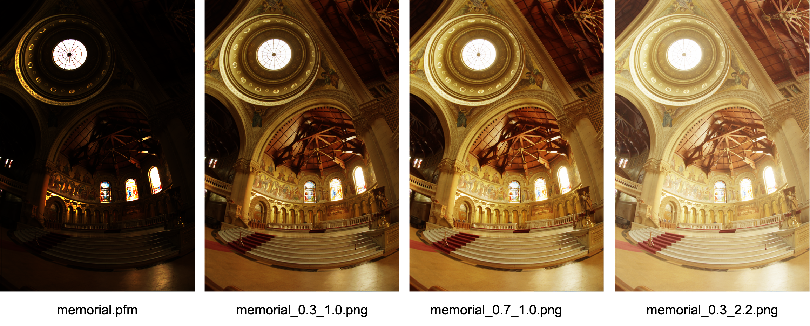
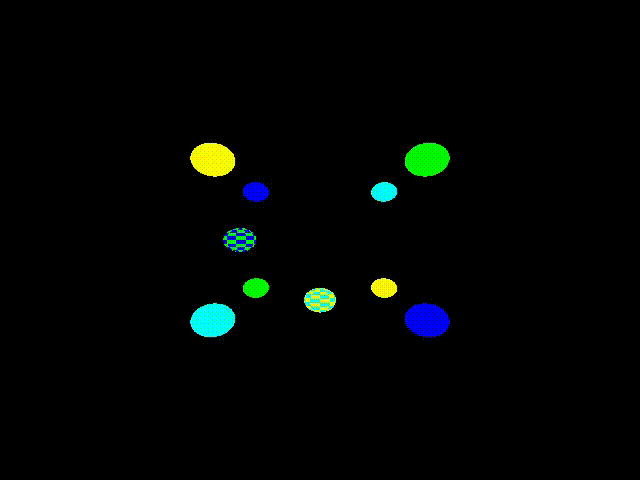
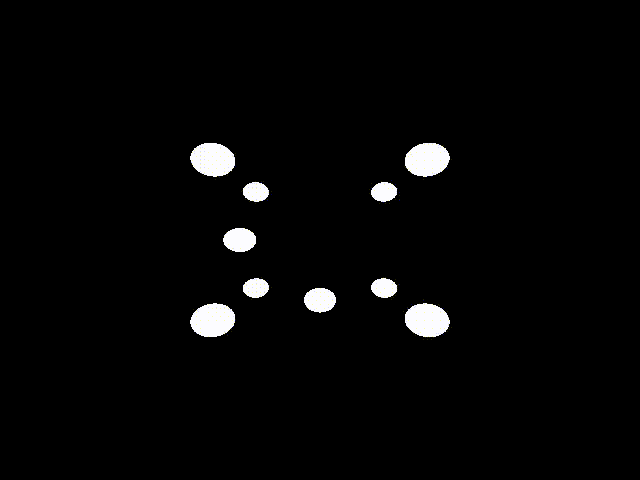
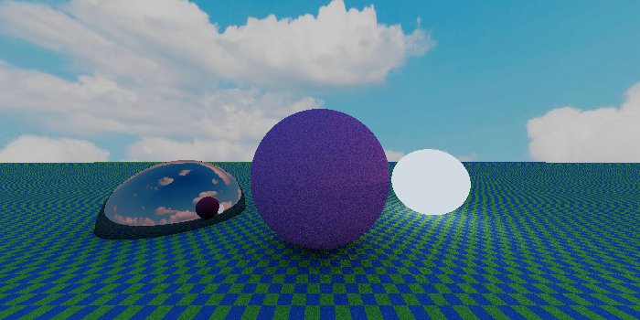

# Photorealistic Rendering
A simple raytracer for generating photorealistic images written in C++. 
It is developed for the course [*Numerical techniques for photorealistic image generation*](https://www.unimi.it/en/education/degree-programme-courses/2021/numerical-tecniques-photorealistic-image-generation) held by professor Maurizio Tomasi (University of Milan, AY2020-2021).

*Note: it is a WIP project*

## Table of Contents

- [Explanation](#explanation)
- [Installation](#installation)
  - [Dependencies](#dependencies)
  - [Install from git repository](#install-from-git-repository)
- [Usage](#usage)
  - [Convert HDR image to LDR](#convert)
  - [Create demo image](#demo)
- [Expectations](#expectations)
- [Contributing](#contributing)
- [License](#license)

## Explanation

More infos coming soon! Stay tuned!

## Installation

### Dependencies

A C++ compiler is needed (C++14 or higher).

You also need to install the following dependencies:
- [Cmake](https://cmake.org/) (version 3.12 or higher);
- [GD library](https://libgd.github.io/) (version 2.3.0 or higher).

### Install from git repository

Clone this repository with the commands: 
```sh
$ git clone https://github.com/ElisaLegnani/PhotorealisticRendering.git
$ cd PhotorealisticRendering
```

Compile:

```sh
$ mkdir build
$ cd build
$ cmake ..
$ make
```

Executables files can be found in the `build` directory.

For testing, run in the `build` directory:

```sh
$ ctest
```

## Usage

The code now implements two features (*WIP*):
- converts HDR image to LDR: `hdr2ldr`
- creates a demo image: `demo`

In the  `build` directory, run: 
  
```sh
$ ./raytracer hdr2ldr

```
or:

```sh
$ ./raytracer demo
```

For further details, see below.

<details><summary name="convert"><b>Convert HDR image to LDR</b></summary>

  In the  `build` directory run: 
  
  ```sh
  $ ./raytracer hdr2ldr
  ```

  The HDR image format supported is PFM, while LDR ones are PNG and JPG.

  Some parameters need to be set according to the preferences in the output image visualisation:
  -  – *luminosity normalization factor*: changes image luminosity (default value: 0.3);
  -  – *monitor calibration factor*: depends on the user's monitor (default value: 1.0);

  You can set these properties directy by command line or being followed step by step:

  #### Command line:

  ```sh
  $ ./raytracer hdr2ldr input_file.pfm 0.3 1.0 output_file.jpg
  ```

  #### Step by step:

  ```sh
  $ ./raytracer hdr2ldr
  Insert input PFM filename: input_file.pfm
  Insert luminosity normalization factor a (0 < a < 1, 0.3 by default): 0.3
  Insert monitor calibration factor gamma (1.0 by default): 1.0
  You may rerun the program and change a and gamma according to the image visualization preferences.
  Insert output PNG/JPG filename: output_file.png
  ```
  
  #### Example:
  
  In the `examples/hdr2ldr` directory, there is a PFM input file called `memorial.pfm`.
  You can play with the code and parameters simply running (in the `build` directory):
  
  ```sh
  $ ./raytracer hdr2ldr ../examples/hdr2ldr/memorial.pfm 0.3 1.0 ../examples/hdr2ldr/memorial_0.3_1.0.png
  ```
 
  <p align="center">
    
  </p>
  
</details>


<details><summary name="demo"><b>Create demo image</b></summary>

  In the  `build` directory run: 
  
  ```sh
  $ ./raytracer demo
  ```

  Two demo images are provided:
  - one composed by ten spheres on a black screen and rendered with the onoff or the flat renderer;
  - the other representing a complex scene rendered with the pathtracer algorithm.

  You can choose :
  - camera type (orthogonal/perspective);
  - image width;
  - image height;
  - angle of view (deg);
  - renderer algorithm (onoff/flat/pathtracer);
  - output filename (PFM/PNG/JPG);
  - number of rays (if using pathtracer algorithm);
  - maximum depth (if using pathtracer algorithm);
  
  again directly or step by step. Here it is shown the command line to run it directly, alternatively it is analogous to the previous feature.

  ```sh
  $ ./raytracer demo perspective width height angle renderer output_file.png n_rays max_depth
  ```
  
  #### Example 1: onoff and flat renderers
  
  You may easily try the code running in the `examples/demo` directory:
  
  ```sh
  $ ./generate-image.sh ANGLE
  ```
  which automatically runs the following code:
  ```sh
  $ ../build/./raytracer demo perspective 640 480 ANGLE flat img/imageANGLE.png
  ```
  
  and you just need to set the `ANGLE` (deg) from which you look at the scene.
  
  #### Animation:
  
  In the `examples/demo` directory, you may generate an animation of the demo scene, rotating 360° around the objects.
  
  In order to run the code, you need to:
  - install `ffmpeg` : `sudo apt install ffmpeg` (or `brew install ffmpeg` if you use Homebrew);
  - install `GNU Parallel` : `sudo apt install parallel` (or `brew install parallel`);
  - find out the number of cores of your machine: `nproc --all`for Linux or `sysctl -n hw.ncpu` for MacOS, to pass as `NUM_OF_CORES` in the command line;
  
  This is needed to run in parallel the code and speed up the execution, otherwise it would take several minutes.
  
  ```sh
  $ ./generate-animation.sh NUM_OF_CORES
  ```
  
  <p align="center">
    
  </p>
  
  The same can be done using the onoff renderer, just changing the renderer to `onoff` in the `examples/demo/generate-image.sh` script before running `generate-animation.sh`:

  ```sh
  $ ../build/./raytracer demo perspective 640 480 ANGLE onoff img/imageANGLE.png
  ```
  
  <p align="center">
    
  </p>
  
  
  #### Example 2: pathtracer renderer
  
  Running the following in the `build` directory:
  ```sh
  $ ./raytracer demo perspective 700 350 0 pathtracer ../img/demo_pathtracer.png 10 2
  ```
  you should obtain this image
  
  <p align="center">
    
  </p>
  
</details>
  
## Expectations

More infos coming soon! Stay tuned!

## Contributing

Please use the [issue tracker](https://github.com/ElisaLegnani/PhotorealisticRendering/issues) to report any bugs or file feature requests.

## License

The code is released under a MIT license. See the file [LICENSE.md](https://github.com/ElisaLegnani/PhotorealisticRendering/blob/master/LICENSE.md).
